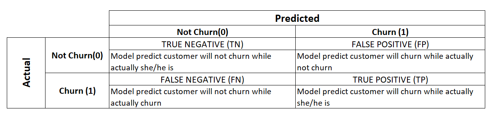
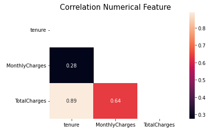
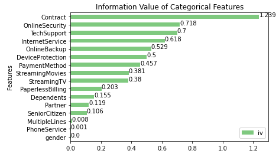
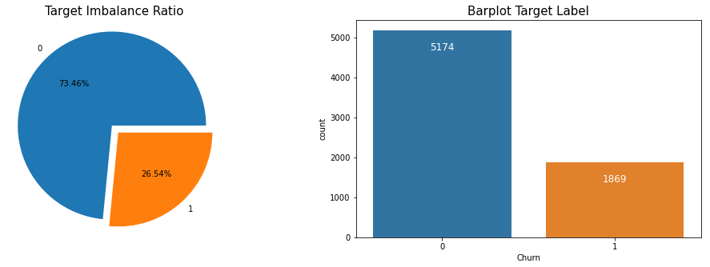
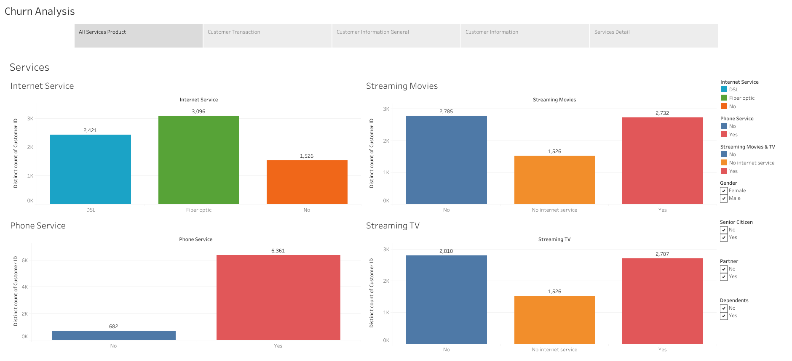
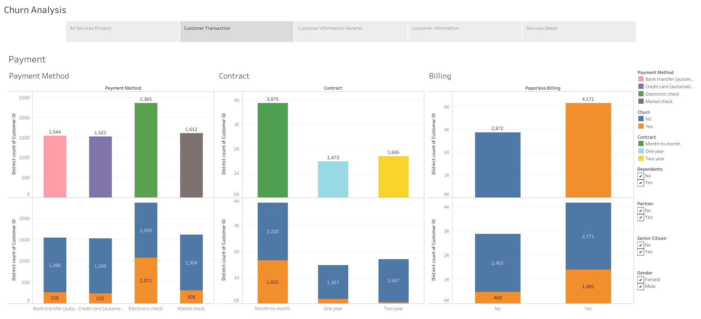
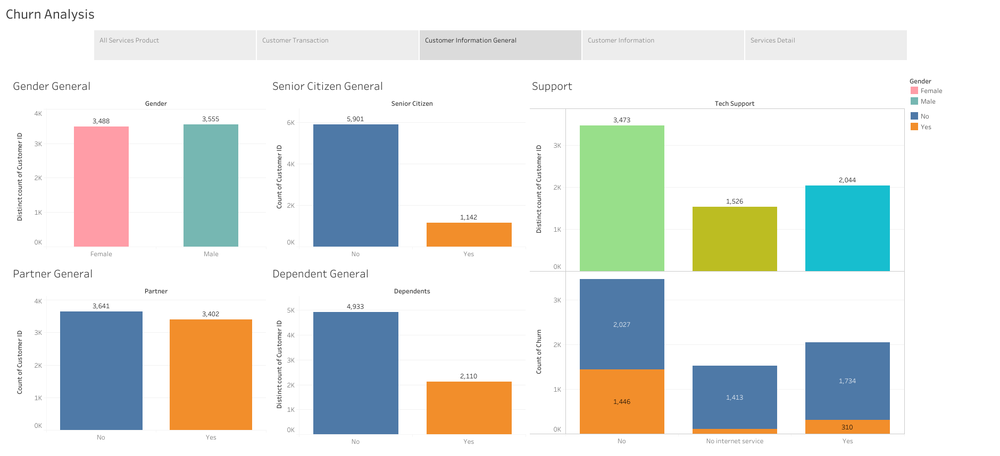
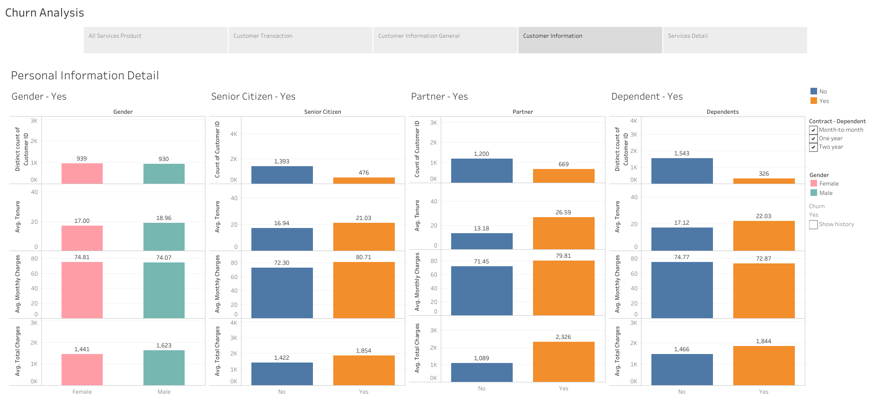
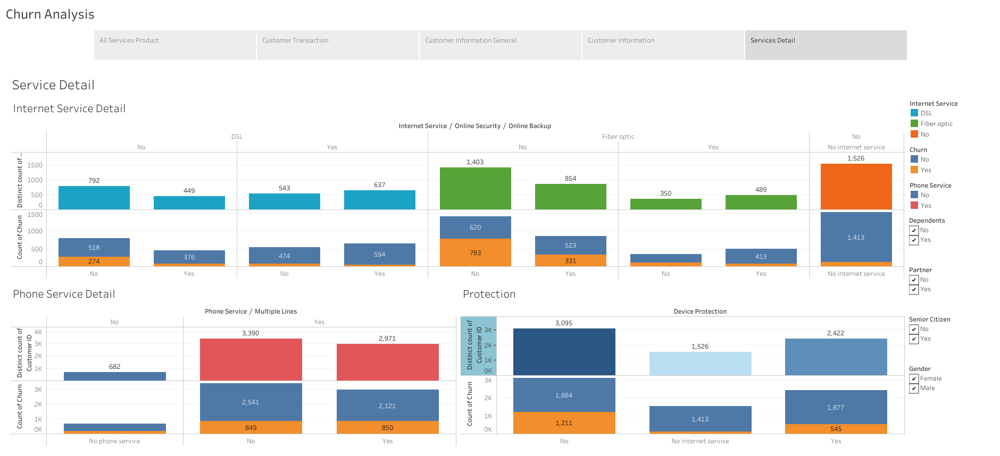

# Churn Analysis with Telco Customer Churn Dataset

In this project, i want to share how to save a lot of money from customer churn. To solve that problem i use data analytics to describe the pattern using Tableau and predict which customer will churn and take action using classification method (supervised learning).

For full process, please visit my portofolio on <a href="https://github.com/Juantonios1/Churn-Analysis-with-Telco-Customer-Churn-Dataset/blob/main/Churn%20Analysis%20with%20Telco%20Customer%20Churn%20Dataset%20Final.ipynb">Churn Analysis</a>.  

<!-- TABLE OF CONTENTS -->

  
Table of Content

  <ol>
    <li>
      <a href="#business-background">Business Background</a>
    </li>
    <li>
      <a href="#data-understanding">Data Understanding</a>
    </li>
    <li>
      <a href="#exploratory-data-analysis">Exploratory Data Analysis</a>
    </li>
    <li><a href="#data-analytics">Data Analytics</a></li>
    <li><a href="#data-preprocessing">Data Preprocessing</a></li>
    <li><a href="#model-selection">Model Selection</a></li>
    <li><a href="#explainable-and-interpretable-machine-learning">Explainable and Interpretable Machine Learning</a></li>
    <li><a href="#conclusion-and-recommendation">Conclusion and Recommendation</a></li>
    <li><a href="#contributors">Contributors</a></li>
  </ol>

## Business Background
**Context :**  
The phenomenon of stopping customers from using a service or service from a company is called churn (customer attrition). Churn is influenced by customer statisfaction and the churn rate is inversely correlated to the level of customer statisfaction which in general if the company can maintain customer statisfaction at a high level then the churn rate will be at a low level. However, nowadays, customers have started to think critically, difficult to be satisfied, less forgiving, and easy to switch to competitors. Coupled with the rapid growth of new competitors, keeping loyal customers is a challenge in itself.The source of this dataset is from <a href="https://www.kaggle.com/blastchar/telco-customer-churn">Kaggle</a>.  

**Problem Statement :**  
Churn has always been a big problem for every service or service provider company because in general, churn customers are dissatisfied with the services or products provided and tend to switch to competitors. By knowing which customers will churn, the company can calculate the churn rate according to business needs and make action to prevent it.

**Goals :**  
To find how much loss caused by churn and predict which customer will churn and find out the reason so company can do action which give the company profit.

**Metric Evaluation :**    
Determine the suitable metric to rate the performance from the model

## Data Understanding

| Feature      	| Description                                                                                                                                                                                                               	|
|--------------	|---------------------------------------------------------------------------------------------------------------------------------------------------------------------------------------------------------------------------	|
| customerID         	| Unique ID for customer                                                                                                                                                                                                           	|
| gender      	| Male or Female                                                                                                                                                                                 	|
| SeniorCitizen     	| Senior citizen or not (>55)                                                                                                                                                                               	|
| Partner          	| Has a partner or not                                                                                                                                                                                                         	|
| Dependents        	| Has dependents or not                     	|
| tenure       	| Number of months the customer has stayed with the company / business                                                                                                                                                                                         	|
| PhoneService   	|Has a phone service or not	|
| MultipleLines        	| Has multiple lines or not                                                                                                                                                                                                          	|
| InternetService         	| Kind of internet                                                                                                                                                      	|
|OnlineSecurity    	| Whether the customer has online security or not	|
|OnlineBackup         	| Has online backup or not                                                                                                                                                                                                            	|
|DeviceProtection         	| Has device protection or not                                                                                                                                                     	|
| TechSupport     	|Has tech support or not                                                                                                                                                     	|
|StreamingTV         	| Has streaming TV or not                                                                                                                                                  	|
| StreamingMovies     	|Has streaming movies or not    
| Contract       	| The contract term of the customer                                                                                                                                                                                                         	|
| PaperlessBilling 	| Gender of candidate      
| Contract       	| The contract term of the customer                                                                                                                                                                                                         	|
| PaperlessBilling 	| Has paperless billing or not
|PaymentMethod| The customer’s payment method 
| MonthlyCharges      	| The amount charged to the customer monthly                                                                                                                                                                                                         	|
| TotalCharges  	| The total amount charged to the customer
| Churn 	|  The measure of customers who stop using a product

## Exploratory Data Analysis
At this stage, a brief analysis of the data will be carried out, as follows:
* Distribution Data Numerical
* Data Cardinalities
* Missing Values
* Identify Outliers
* Identify Duplicates
* Data Correlation Numerical

* Data Correlation Categorical

* Data Imbalance

## Data Analytics
At this stage, another information analysis will be carried out, as follows:
* Product Services Analysis

* Customer Transaction

* Customer Information

* Personal Information

* Service Detail

* Loss caused by Churn
* Data Proportion based on Target
* Independent Test with Chi-squared
* Senior Citizen Feature

## Data Preprocessing
At this stage, data preparation and processing will be carried out before being used as a data model, as follows:
* Transformer
* Splitting Data

## Model Selection
At this stage will be done making and optimizing the machine learning model, as follows:
* Model Benchmark
* Feature Selection
* Imbalance Method
* Hyperparameter Tuning

## Explainable and Interpretable Machine Learning
At this stage there will be an explanation in the decision making of the machine learning model, in the following ways:
* SHAP 

## Conclusion and Recommendation
We conclude our result and give recommendation based on it
* Summary Model
* Business Insight

This model has performance 73%, its mean our model can predict (other factors are ignored) 1308 customers from 1869 customer which churn, and if our action is suitable, we can prevent 97367.52 dollar per month and with average tenure we will prevent company loss 3115760.64 dollar. 
* Recommendation
  * Make a bundle for all product with interesting cost.
  * Company can give discount for customer who predict will churn.
  * Company can give special offer to customer with short period contract to prevent customer churn.

## Contributors:
Juan Antonio Suwardi - antonio.juan.suwardi@gmail.com  
